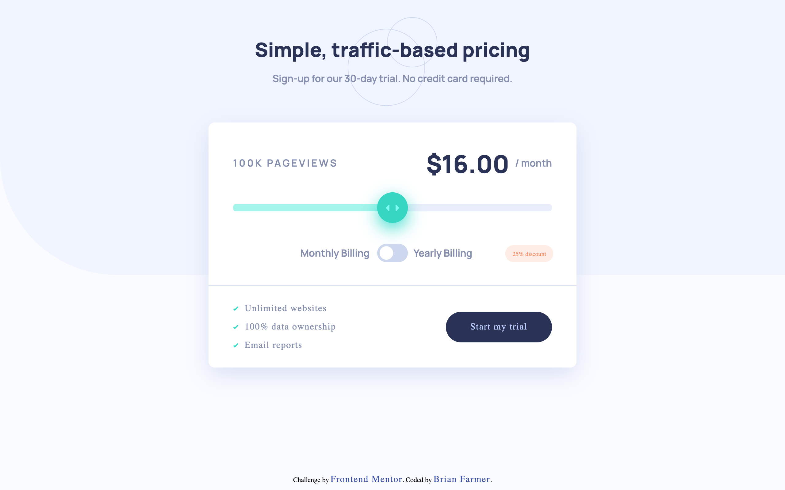

# Frontend Mentor - Interactive pricing component solution

This is a solution to the [Interactive pricing component challenge on Frontend Mentor](https://www.frontendmentor.io/challenges/interactive-pricing-component-t0m8PIyY8). Frontend Mentor challenges help you improve your coding skills by building realistic projects.

## Table of contents

- [Overview](#overview)
- [The challenge](#the-challenge)
- [Screenshot](#screenshot)
- [Links](#links)
- [My process](#my-process)
- [Built with](#built-with)
- [What I learned](#what-i-learned)
- [Continued development](#continued-development)
- [Useful resources](#useful-resources)
- [Author](#author)

## Overview

### The challenge

The user should be able to:

- View the optimal layout for the app depending on their device's screen size
- See hover states for all interactive elements on the page
- Use the slider and toggle to see prices for different page view numbers

### Screenshot



### Links

- GitHub URL: [https://github.com/brianlfarmerllc/fem_interactive_pricing_component](https://github.com/brianlfarmerllc/fem_interactive_pricing_component)
- Live Site URL: [https://fem-pricing-component.netlify.app/](https://fem-pricing-component.netlify.app/)

## My process

### Built with

- Semantic HTML5 markup
- CSS3
- SASS Preprocessor
- JavaScript
- Object oriented programming concepts
- ES6 Classes

### What I learned

I wanted to do this challenge to learn how to make a custom range slider and a toggle switch which was much harder than I anticipated. This also seemed like a good project to continue practicing Object Oriented Programing with ES6 classes. I was able to create a slider class and attach methods to it to create the slider functionality and color styling. I had not originally intended to create two slider objects instances but having the ability to create one for mobile and one for desktop was easier than doing a bunch of repositioning with CSS.

I also made use of before and after pseudo element text to position parent elements just the way I wanted or to swap text. One example was with the discount banner next to the toggle. With the empty span element I was able to swap out the ::after content text with @media instead of using JavaScript

```html
<span class="discount"></span>
```

normal desktop view

```css
.discount::after {
  content: "25% discount";
  position: absolute;
  right: 38px;
  bottom: 38px;
  color: $lightRed;
  background: $lightGrayishRed;
  padding: 0.75rem 1.15rem;
  border-radius: 25px;
}
```

@media content swap

```css
.discount::after {
  content: "-25%";
  right: 20px;
  bottom: 42px;
  padding: 0.3rem 0.75rem;
  border-radius: 25px;
}
```

### Continued development

I really like this component and it has a lot of useful features that I could use in other projects. One thing I would like to come back and figure out is how to attach the event listener in the class object. I know it can be done but I was having trouble implementing it.

### Useful resources

- [CSS-Tricks on range slider](https://css-tricks.com/sliding-nightmare-understanding-range-input/) - I was at a loss with the range slider until I read this article. There is a lot too it and it took me a could sittings to finish.
- [W3 Custom Toggle Switch](https://www.w3schools.com/howto/howto_css_switch.asp) - I used this as a baseline for my toggle but in order to ensure the JavaScript click event was triggering I actually had to make the width and height 100% on the hidden checkbox.

## Author

- Website - [Brian Farmer](https://brianfarmerwebdev.netlify.app)
- GitHub URL: - [GitHub URL](https://github.com/brianlfarmerllc)
- Frontend Mentor - [@brianlfarmerllc](https://www.frontendmentor.io/profile/brianlfarmerllc)
